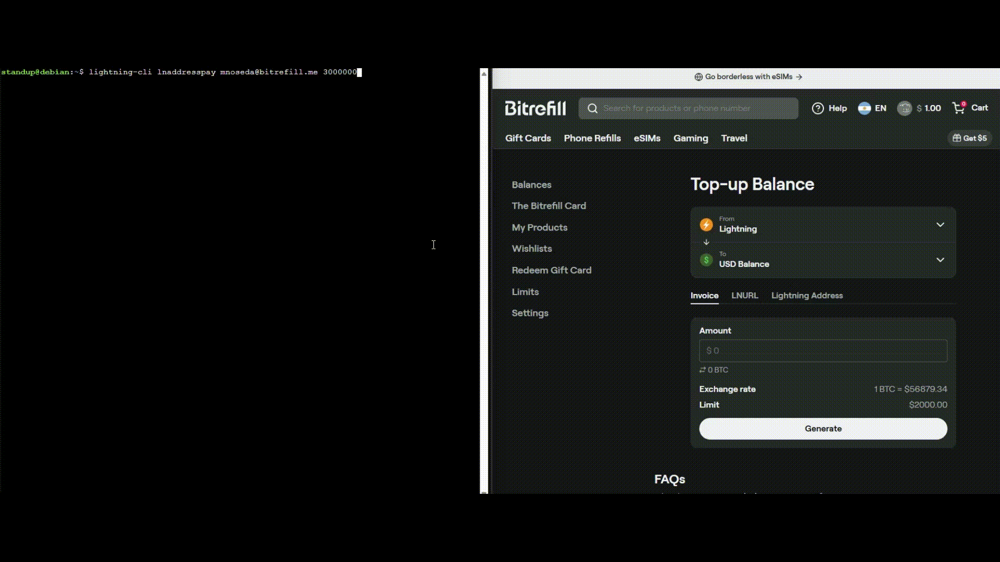

# Ln-Address-Pay

This simple plugin adds the ability to pay to a lightning address as described on https://lightningaddress.com/
Some services, such as Bitrefill already offer the posibility to create your own lightning address to top up your account.


## Usage

Only one command is added and the only obligatory parameters are the address and the msats to send
```bash
lightning-cli lnaddresspay address msatoshis [label] [riskfactor] [maxfeepercent] [retry_for] [maxdelay] [exemptfee]
```

E.g.
```bash
lightning-cli lnaddresspay address123@lightning.com 1000000 [label] [riskfactor] [maxfeepercent] [retry_for] [maxdelay] [exemptfee]
```

## Demo

